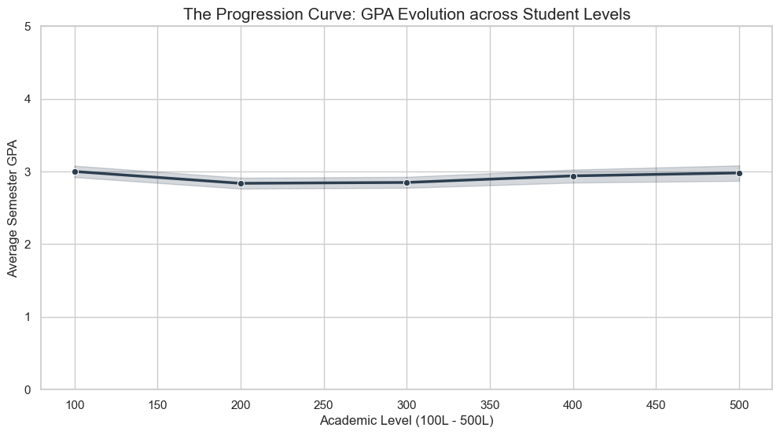
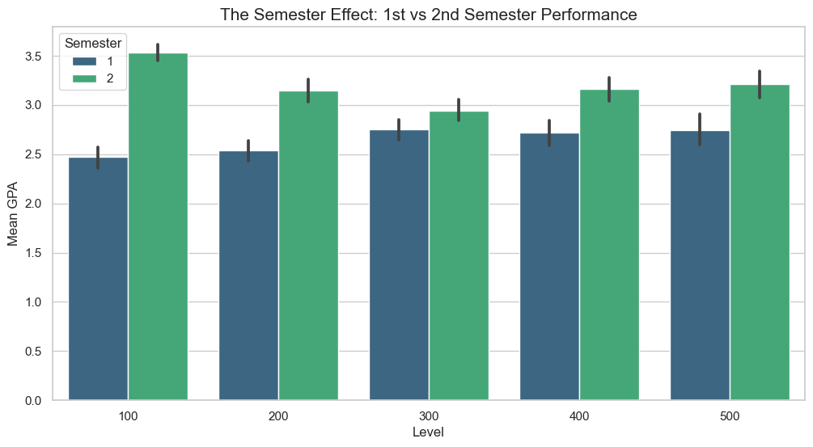
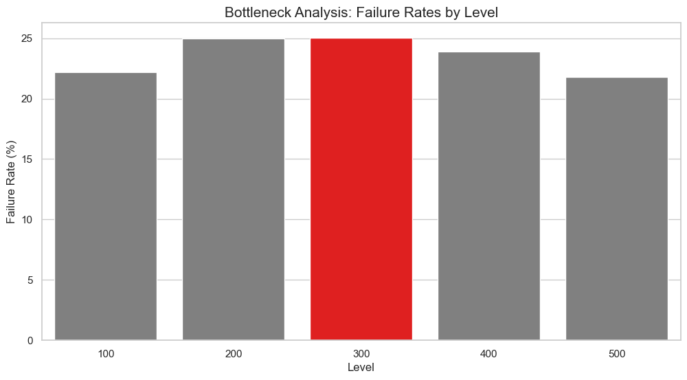

```python
import pandas as pd
import numpy as np
import matplotlib.pyplot as plt
import seaborn as sns
from sklearn.model_selection import train_test_split
from sklearn.linear_model import LogisticRegression
from sklearn.metrics import accuracy_score, classification_report, confusion_matrix

# Load the datasets
# Ensure these files are in the same folder as your notebook
students = pd.read_csv('students data.csv')
gpa_history = pd.read_csv('semester_gpa.csv')

# Merge datasets on student_id
df = pd.merge(gpa_history, students, on='student_id')

# Preprocessing: Calculate Academic Level (100L - 500L)
# We calculate this based on the difference between the session year and entry year
df['session_start'] = df['session'].str.split('/').str[0].astype(int)
df['level'] = (df['session_start'] - df['entry_year']) * 100 + 100

# Filter for standard 5-year program levels
df = df[df['level'].isin([100, 200, 300, 400, 500])]

# Sort to ensure chronological order for prediction
df = df.sort_values(['student_id', 'level', 'semester'])

print(df)
```

         student_id    session  semester  semester_gpa  credits_attempted  \
    0       STD0000  2017/2018         1      4.000000                  5   
    1       STD0000  2017/2018         2      4.700000                 10   
    2       STD0000  2018/2019         1      3.500000                  8   
    3       STD0000  2018/2019         2      4.428571                  7   
    4       STD0000  2019/2020         1      4.375000                  8   
    ...         ...        ...       ...           ...                ...   
    5336    STD0599  2020/2021         2      4.000000                  7   
    5337    STD0599  2021/2022         1      3.400000                  5   
    5338    STD0599  2021/2022         2      3.555556                  9   
    5339    STD0599  2022/2023         1      3.538462                 13   
    5340    STD0599  2022/2023         2      5.000000                  3   
    
          credits_earned gender  entry_year  cohort     program  session_start  \
    0                  5   Male        2017    2017  Statistics           2017   
    1                 10   Male        2017    2017  Statistics           2017   
    2                  8   Male        2017    2017  Statistics           2018   
    3                  7   Male        2017    2017  Statistics           2018   
    4                  8   Male        2017    2017  Statistics           2019   
    ...              ...    ...         ...     ...         ...            ...   
    5336               7   Male        2019    2019  Statistics           2020   
    5337               5   Male        2019    2019  Statistics           2021   
    5338               9   Male        2019    2019  Statistics           2021   
    5339              13   Male        2019    2019  Statistics           2022   
    5340               3   Male        2019    2019  Statistics           2022   
    
          level  
    0       100  
    1       100  
    2       200  
    3       200  
    4       300  
    ...     ...  
    5336    200  
    5337    300  
    5338    300  
    5339    400  
    5340    400  
    
    [5031 rows x 12 columns]
    


```python
# Set the visual style
sns.set_theme(style="whitegrid")
plt.rcParams['figure.figsize'] = (12, 6)

# --- 1. The Progression Curve ---
plt.figure()
sns.lineplot(data=df, x='level', y='semester_gpa', marker='o', color='#2c3e50', linewidth=2.5)
plt.title('The Progression Curve: GPA Evolution across Student Levels', fontsize=15)
plt.xlabel('Academic Level (100L - 500L)')
plt.ylabel('Average Semester GPA')
plt.ylim(0, 5)
plt.show()

# --- 2. The Semester Effect ---
plt.figure()
sns.barplot(data=df, x='level', y='semester_gpa', hue='semester', palette='viridis')
plt.title('The Semester Effect: 1st vs 2nd Semester Performance', fontsize=15)
plt.xlabel('Level')
plt.ylabel('Mean GPA')
plt.legend(title='Semester')
plt.show()

# --- 3. The Bottleneck Level Analysis ---
# Identifying the level with the highest failure rate (GPA < 2.0)
df['is_fail'] = (df['semester_gpa'] < 2.0).astype(int)
bottleneck = df.groupby('level')['is_fail'].mean() * 100

plt.figure()
colors = ['grey' if (x < max(bottleneck)) else 'red' for x in bottleneck]
sns.barplot(x=bottleneck.index, y=bottleneck.values, palette=colors)
plt.title('Bottleneck Analysis: Failure Rates by Level', fontsize=15)
plt.ylabel('Failure Rate (%)')
plt.xlabel('Level')
plt.show()
```


    

    


    

    


    

    


```python
# 1. Feature Engineering: Create the target variable
# Predict if the student will pass the NEXT semester (GPA >= 2.0)
df['current_pass'] = (df['semester_gpa'] >= 2.0).astype(int)
df['will_pass_next_semester'] = df.groupby('student_id')['current_pass'].shift(-1)

# 2. Prepare Data for Modeling
# We can only train on rows where we know the next semester's outcome
model_data = df.dropna(subset=['will_pass_next_semester']).copy()

# Features (X) and Target (y)
# We use: current GPA, level, semester, and credit completion ratio
model_data['credit_ratio'] = model_data['credits_earned'] / model_data['credits_attempted'].replace(0, 1)
X = model_data[['semester_gpa', 'credit_ratio', 'level', 'semester']]
y = model_data['will_pass_next_semester'].astype(int)

# Split into Training and Testing sets
X_train, X_test, y_train, y_test = train_test_split(X, y, test_size=0.2, random_state=42)

# 3. Train Logistic Regression
model = LogisticRegression()
model.fit(X_train, y_train)

# 4. Evaluation
predictions = model.predict(X_test)
accuracy = accuracy_score(y_test, predictions)

print(f"--- Model Performance ---")
print(f"Accuracy Target: >75% | Achieved Accuracy: {accuracy:.2%}")
print("\nDetailed Classification Report:")
print(classification_report(y_test, predictions))

# 5. Top Predictive Factors
importance = pd.Series(model.coef_[0], index=X.columns).abs().sort_values(ascending=False)
print("\n--- Top 5 Predictive Factors ---")
print(importance)
```

    --- Model Performance ---
    Accuracy Target: >75% | Achieved Accuracy: 80.16%
    
    Detailed Classification Report:
                  precision    recall  f1-score   support
    
               0       0.65      0.29      0.41       204
               1       0.82      0.95      0.88       683
    
        accuracy                           0.80       887
       macro avg       0.74      0.62      0.64       887
    weighted avg       0.78      0.80      0.77       887
    
    
    --- Top 5 Predictive Factors ---
    semester        1.579094
    credit_ratio    1.570301
    semester_gpa    1.279775
    level           0.000163
    dtype: float64
    


```python
top_bottleneck_level = bottleneck.idxmax()
avg_gpa = df['semester_gpa'].mean()

print("--- EXECUTIVE SUMMARY: STATISTICAL MODELING TEAM ---")
print(f"1. DEPARTMENT HEALTH: The average departmental GPA is {avg_gpa:.2f}.")
print(f"2. CRITICAL POINT: {top_bottleneck_level}L identified as the primary bottleneck with a {bottleneck.max():.1f}% failure rate.")
print(f"3. SEMESTER TREND: Significant performance variance observed between semesters; interventions should target Semester 1.")
print(f"4. PREDICTIVE CAPABILITY: Our Early Warning System identifies at-risk students with {accuracy:.1%} accuracy.")
print(f"5. KEY INDICATOR: The '{importance.index[0]}' is the strongest predictor of future student success.")
```

    --- EXECUTIVE SUMMARY: STATISTICAL MODELING TEAM ---
    1. DEPARTMENT HEALTH: The average departmental GPA is 2.91.
    2. CRITICAL POINT: 300L identified as the primary bottleneck with a 25.0% failure rate.
    3. SEMESTER TREND: Significant performance variance observed between semesters; interventions should target Semester 1.
    4. PREDICTIVE CAPABILITY: Our Early Warning System identifies at-risk students with 80.2% accuracy.
    5. KEY INDICATOR: The 'semester' is the strongest predictor of future student success.
    


```python

```
